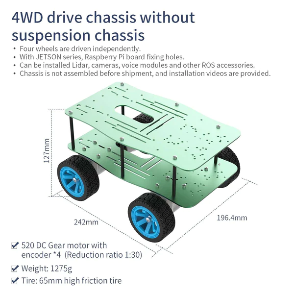

# Penn State SWENG452W Final Project
This repo contains the final project for SWENG-452W. I created a Remote Controller (RC) car running on a Raspberry Pi 4 that can be controlled via a Ground Control Station (GCS) on another computer. The Robot Operating System (ROS) was selected as the main tool for interacting with the hardware - due to it being the industry standard.

There are two modes for this software: simulation (sim) and real hardware (real) modes. This README will cover and provide resouces on how to set-up both environments and the GCS for testing and/or operations.

# The Simulation-Mode Set-Up
The sim-mode allows for development and testing of the remote control system without having to mount to actual hardware. This allowed me to save time and money in development. Currently the project uses [Gazebo](https://gazebosim.org/home) as the simulator of choice and [Windows System for Linux 2](https://learn.microsoft.com/en-us/windows/wsl/about) (WSL2) to run ROS and Gazebo for simulator operations. This section will cover how to set-up a simulator environment and the GCS.

## WSL2
WSL2 was chosen over a standard virtual machine due to the face GPU bypassing is built in the platform. This allows you to use anything with a Graphical User Interface (GUI) natively - additionally, it allowed me connect, develop and cross-compile on [Visual Studio Code](https://code.visualstudio.com/docs/remote/wsl) on my Windows host machine. WSL2 running Ubuntu 20 will be installed.

### Installing WSL2-Base
Open PowerShell in admin mode. This can be done by searching for `powershell` in the Windows search bar. Next, right click the serach result and select `Run as administrator`.


Next type the text below into the powershell to install base WSL2 onto your computer. 
``` powershell
wsl --install
```

### Install WSL2 Ubuntu 20
In the Windows search bar, type `windows store`. In the Windows store search for `Ubuntu 20` and select `Ubuntu 20.04.6 LTS` - then install it.


### WSL2 Network Configuration

#### Find WSL2 IP Address
In your new WSL2-Ubuntu 20 environment, you will find you WSL2 ip address using this command
``` bash
ip addr | grep eth0
```
After entering this command, you should see this:

**Copy down the IP adress underlined, this will be the IP address you will input into the GCS (GCS will send commands to this IP address) and for the next step in the network configuration.**

#### WSL2 Port-Forwarding using Port-Proxy
For WSL2 to receive the command messages from the GCS You must create a Port Forwarding for WSL2. Open your `powershell` and enter this command to create a permanent port forwarding.
``` powershell
netsh interface portproxy add v4tov4 listenport=3390 listenaddress=0.0.0.0 connectport=3390 connectaddress=<INSERT_WSL2_IP_ADDRESS_HERE>
```
Input the WSL2 IP from the previous sub-section in the `connectaddress` portion in the code provided above.

#### Firewall
If you receive a Windows firewall error, create a `Inbound Rule` for your WSL2 port. First go to `Settings` --> `Network & Internet` --> `Advanced Settings`. 


In the firewall program, select `Inbound Rules` and select `New Rule..`.


Follow these settings for the `New Inbound Rule Wizard`:
- **Rule Type**: Port
- **Protocol and Ports**: TCP and specific local ports: 3390
- **Action**: Allow for connection
- **Profile**: Make sure all boxes (Domain, Private) are checked
- **Name**: Anything you wish

### Install ROS on WSL2-Ubuntu 20
For this section, you can install ROS in you new WSL2-Ubuntu 20 environment using two methods. 

#### Install ROS, ROS workspace and Project automatically using Installation BASH script
The installation bash script in the main portion of this repo will automate the installation of ROS, workspace creation and install the ROS project/packages. **It's recommended to manually install, so you can understand the process.** If you run this script `installROS.sh`, there is no need to do the following sub-sections. Use the command below in the main directory (assuming you git cloned the directory into WSL2).
``` bash
./installROS
```
#### Install ROS and Project Manually
The manual sub-section is in two parts, installing ROS, setting up ROS workspace and installing the final project. This will be done in the WSL2-Ubuntu 20 environment.

##### ROS Installation
Here are the instructions for ROS installation - if you would like for indepth information follow [Ubuntu install of ROS Noetic](https://wiki.ros.org/noetic/Installation/Ubuntu).

Setup ROS sources list
``` bash
sudo sh -c 'echo "deb http://packages.ros.org/ros/ubuntu $(lsb_release -sc) main" 
> /etc/apt/sources.list.d/ros-latest.list'
```
Install Curl for keys download
``` bash
sudo apt install curl -y
```
Install GIT so you can download final project from GitHub
``` bash
sudo apt install git -y
```
Update Keys
``` bash
curl -s https://raw.githubusercontent.com/ros/rosdistro/master/ros.asc | sudo apt-key add -
```
Update you system
``` bash
sudo apt update
```
Install ROS version: Noetic
``` bash
sudo apt install ros-noetic-desktop-full
```
Add the ROS workspace sourcing to your bashrc,
Will automatically start ROS on terminal start-up. 
``` bash
echo "source /opt/ros/noetic/setup.bash" >> ~/.bashrc
```
Source (restart) your bash environment to start ROS. This will happen automatically in the future.
``` bash
source ~/.bashrc
```
Install Python dependencies
``` bash
sudo apt install python3-rosdep python3-rosinstall python3-rosinstall-generator python3-wstool build-essential -y
```
Start the Python ROS-Dep
``` bash
sudo rosdep init
```
Update ROS-Dep
``` bash
rosdep update
```
##### Creating a ROS Workspace
In this sub-section, we will create a ROS workspace to develop and program ROS programs, packages and projects. In you home directory in WSL2, run this command to create the directories.
``` bash
mkdir -p ~/catkin/src
```
Next, we will initialize the ROS workspace.
``` bash
cd ~/catkin/src
catkin_init_workspace
```
Now go back to the main work directory and do the initial make in the ROS workspace.
``` bash
catkin_make
```

##### Final Project Installation
In this sub-section we will set up and installation of the final project. In WSL2 environment go into you new ROS workspace
Now lets git clone the final project into the ROS workspace
``` bash
cd ~/catkin/src
``` 
Now GIT clone the repo into you source code section.
``` bash
git clone https://github.com/carte731/sweng452w-fp.git
```
Now initialize the sub-module git repos **(This step is not nesscessry if you're not running on real hardware aka. moving a real RC car/robot).**
``` bash
cd sweng452w-fp
git submodule init
``` 
Next, we will download the simulator repos **(This step is not nesscessry if you're not running on real hardware aka. moving a real RC car/robot).**
``` bash
git submodule update --recursive
```
After going back to the main ROS workspace. We will download all the require project dependcies using this command.
``` bash
cd ~/catkin/
rosdep install --from-paths src/ -y
```
Next install the hardware drivers **(This step is not nesscessry if you're not running on real hardware aka. moving a real RC car/robot).**
``` bash
cd /src/sweng452w-fp/real_mode/Driver_installer
sudo python3 setup.py install
```
Finally, make your ROS workspace
``` bash
cd ~/catkin/
catkin_make
```

# The RealTime-Mode Set-Up
You will have to set up both the Raspberry-Pi 4 and the hardware.

## Raspberry-Pi 4 
You will need a Raspberry Pi 4 and an microSD card and a means to mount it to computer (to install an OS to the SD card).

### Set-Up
In this section you will be installing Ubuntu-20 Server. There is no GUI by default for the server versions of Ubuntu. Everything must be done through a terminal or a remote IDE like Visual Studio Code.

#### Install Imager
Download and install the [Raspberry Pi Imager](https://www.raspberrypi.com/software/). 
#### Install Unbuntu-20 on MicroSD
Insert SD card into PC. There are three sections that must be fill out, enter these settings:

- **Raspberry Pi Device**: Raspberry Pi 4
- **Operating Systems**: scroll down and select `Other general-purpose OS`, Select `Ubuntu` and then scroll down and select: `Ubuntu Server 20.04.5 LTS (64-bit)`.
- **Storage**: Select your MicroSD card.

**_IMPORTANT_: AFTER SELECTING `NEXT`, THEN SELECT `EDIT SETTINGS` AND APPLY YOUR NETWORK SETTINGS AND ENABLE SSH.**


**_IMPORTANT_: FOR THE GENERAL TAB - ENTER YOUR NETWORK INFORMATION, DON'T COPY WHAT IS PRESENTED IN THE EXAMPLE IMAGE**


**_IMPORTANT_: FOR THE SSH TAB - APPLY THE SAME SETTINGS**

**THIS IS _IMPORTANT_, BECAUSE YOU WILL BE ABLE TO SSH DIRECTLY INTO THE UBUNTU-20 SERVER AND WON'T HAVE TO MANUALLY CONFIGURE NETWORK SCRIPTS (IT'S A PAIN TO DO THIS).**

### SSHing into Raspberry Pi for the first time
Open your powershell **_(ensure you have openssh installed)_** and enter:
``` powershell
ssh [username]@[hostname].local
```
The `username` and `hostname` come from what you selected in the OS set-up using the imager in the last [sub-section](#install-unbuntu-20-on-microsd). 
If this doesn't work, you will have to manually attach a monitor to the Raspberry Pi 4 to collect your IP address (Directions below) and then use this command:
``` powershell
 ssh [username]@[IP address]
```

### Obatining Raspberry-Pi IP address
Find your IP address in the Pi using the commands mention in [earlier sub-sections](#find-wsl2-ip-address). **This address is important, this is what you will send commands to (from the GCS) and how you will SSH into the device normally.**

## Hardware Set-Up and Configurations
For this project, I used [YahBoom](http://www.yahboom.net/home) for my robot car chassis. They provide an assortment of chassis, boards and accessories robotics design.

### Chassis
I chose the [Yahboom Aluminum Alloy ROS Robot Car Chassiss](https://category.yahboom.net/products/ros-chassis?_pos=1&_sid=4b44cf093&_ss=r&variant=44178906939708). It's a basic chassis, with just wheels and a mounting frame - the final project I created provides the drive control, so the more complex platforms were not needed. Here's a tutorial showing how to assemble the chassis: [4WD chassis Installation Video](https://youtu.be/sRYrv7y6zoY?si=ojyGAra0tV3s3jSz)



### Hardware Control Board
The control board interfaces with the hardware and allows communication with the hardware through a centerized system. I chose the [YahBoom ROS Robot Control Board](https://category.yahboom.net/products/ros-driver-board?_pos=1&_sid=f40392f38&_ss=r) - my program interfaces with the board to send drive commands to the hardware.


### Assembly
The Installation video provided above will show you have to assemble the chassis. The [ROS installation sub-section](#Final-Project-Installation) above will install the hardware controller drivers. 

For further details, please read the material below:
- [ROS Robot chassis repository](http://www.yahboom.net/study/ROS-chassis)
- [ROS robot expansion board repository](http://www.yahboom.net/study/ROS-driver-Board)

# Connect Visual Studio Code to Raspberry Pi and WSL2
It is helpful to connect Visual Studio code to either the Raspberry-Pi (Real-Mode) and to WSL2  (Sim-Mode) to update config files or to experiment with the program and settings. It makes cross system development, cross-compiling a lot easier. 

Follow these links to learn how: 
- [Remote Development using SSH](https://code.visualstudio.com/docs/remote/ssh)
- [Using C++ and WSL in VS Code](https://code.visualstudio.com/docs/cpp/config-wsl)
- [Developing in WSL](https://code.visualstudio.com/docs/remote/wsl)

# The Ground Control Station (GCS)
The GCs send commands to the RC car/robot from another computer or VM running Linux (Generally Ubuntu 20, but should be able to run on any OS. Other OS's haven't been tested). It runs off a GUI, that requires [ QT Creator](https://www.qt.io/product/development-tools) to run. The GCS runs off of Qt Creator 4.5.2 (later versions have not been tested).


## Setting up GCS


### Virtual Machine (VM) Set-Up
In a VM environment of your choice create or use a Ubuntu/Linux environment. Change the network type to `bridged` for that VM.


### Installing QT-Creator

Next, install QT-Creator 4.5.2 using these commands
``` bash
sudo apt install qtcreator
sudo apt install qt5-default
```

Start the QT-Creator in the VM and open the

Next open a terminal in the VM that will run the GCS QT files located in `sweng452w/GCS/GCS` in the repo directory. Press the play button in the bottom left corner of the window. A panel displayed in the section header should appear.


This also compiles the program, a file named `GCS` will appear in the build directory. This is your executable and can run directly.

### Retrieving VM IP Adress
Next we will retrieve the VM IP - this is down, so the RC car/robot can send telemetry and confirmation data back to the GCS. Like with WSL2 - open a terminal and type in this command:
``` bash
ip addr | grep enp
```
**Copy down the VM's IP address - this is what you will input into the RC cars config file for sim and real modes.**

## GCS Controls

### RC Controls and Execution Mode
Here is a break-down of main panel:

#### Controls
- **UP**: Moves the RC car forwards.
- **DOWN**: Moves the RC car backwards.
- **QUIT**: Forces the RC car to stop operations - have to restart system afterwards.

#### Execution Mode
- **Queue Mode Start**: As commands are entered or inputted via a `command execution file`, they will be loaded into a queue located to the right. Once this button is press, the program will execute each task in order and remove them fromt the queue.
- **Real-Time Mode**: As buttons are pressed, they are immediately sent out to the RC car/robot.

#### File
- **Network Config**: This allows the user to set the IP adress and port of either the WSL2 environment running the simulator or the actual RC car/robot hardware. Additionally, it can set the port number for the GCS (so the GCS can receive telemetry and heartbeats from the RC car/robot). 
- **Open CMD file**: A CMD file *(extension must be .CEF)* contains commands to be sent to the RC car/robot. **Commands that are accepted are UP, DOWN and QUIT.** All other commands are ignored by the RC system. Real-Time mode, the commands are read automatically - for Queue-Mode, the `Queue Mode Start` button has to be pressed. A sample of a .CEF file in located in the main GCS directory

#### Windows
- **Command Execution Queue**: Shows either the commands in the queue - the order of execution in Queue-Mode. Or the current command being executed int Real-Time Mode.
- **Telemetry/Status**: Shows the GCS status messages and shows any inbound data from the RC car/robot.

# Running Sim and Real Modes
For both modes, the GCS **needs** to be started first.

## Running Simulation-Mode
Open both you WSL2 and Ubuntu VM.

### GCS Start-Up on VM (SIM)
Start QT-Creator and press the play button *or* run the executable file (generated by QT-Creator) named GCS in the build directory. **Select `File-->Network Config` and enter the RC car/robot IP address (from WSL2). Additionally, choose a port for the GCS (default is 9000).**


Select mount to save inputs, the server should restart and the GCS is ready.

### RC Car Start-Up on WSL2 (SIM)
In the main directory there are two files: `config.sh` and `RCStart.sh`. Config file **must** be set with correct IP and Port addresses for the VM running the GCS and the GCS Port.

#### Config File (SIM)
In the main directory open the `config.sh` file and input the GCS (VM) IP address and the port you selected in the last sub-section: [GCS Start-Up](#gcs-start-up-on-vm). The RC port must match the port created in the [WSL2 port forwarding section](#WSL2-Port-Forwarding-using-Port-Proxy)

Run the command below to start sim mode, put nothing in for a help print out.
``` bash
./RCStart.sh sim
```


A simulator window should open running Gazebo with a robot, input commands to move the RC car/robot.

## Running Real-Mode
The instructions are the same as with sim mode - the only difference being:
### GCS Start-Up on VM (SIM)
- Set up is the same as with Sim-Mode.
### RC Car Start-Up on WSL2 (REAL)
- SSH into the Raspberry-Pi and to set-up config settings.
- Use this command to start Real-Mode:
``` bash
./RCStart real
```

