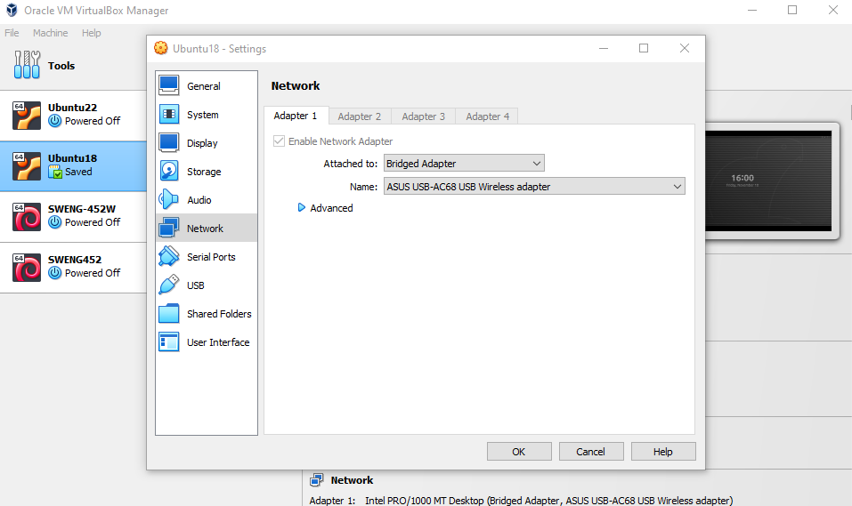
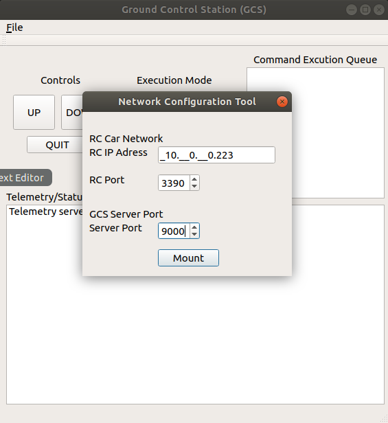

# The Ground Control Station (GCS)
The GCs send commands to the RC car/robot from another computer or VM running Linux (Generally Ubuntu 20, but should be able to run on any OS. Other OS's haven't been tested). It runs off a GUI, that requires [ QT Creator](https://www.qt.io/product/development-tools) to run. The GCS runs off of Qt Creator 4.5.2 (later versions have not been tested).


## Setting up GCS


### Virtual Machine (VM) Set-Up
In a VM environment of your choice create or use a Ubuntu/Linux environment. Change the network type to `bridged` for that VM.



### Installing QT-Creator

Next, install QT-Creator 4.5.2 using these commands
``` bash
sudo apt install qtcreator
sudo apt install qt5-default
```

Start the QT-Creator in the VM and open the

Next open a terminal in the VM that will run the GCS QT files located in `sweng452w/GCS/GCS` in the repo directory. Press the play button in the bottom left corner of the window. A panel displayed in the section header should appear.


This also compiles the program, a file named `GCS` will appear in the build directory. This is your executable and can run directly.

### Retrieving VM IP Adress
Next we will retrieve the VM IP - this is down, so the RC car/robot can send telemetry and confirmation data back to the GCS. Like with WSL2 - open a terminal and type in this command:
``` bash
ip addr | grep enp
```
**Copy down the VM's IP address - this is what you will input into the RC cars config file for sim and real modes.**

## GCS Controls

### RC Controls and Execution Mode
Here is a break-down of main panel:

#### Controls
- **UP**: Moves the RC car forwards.
- **DOWN**: Moves the RC car backwards.
- **QUIT**: Forces the RC car to stop operations - have to restart system afterwards.

#### Execution Mode
- **Queue Mode Start**: As commands are entered or inputted via a `command execution file`, they will be loaded into a queue located to the right. Once this button is press, the program will execute each task in order and remove them fromt the queue.
- **Real-Time Mode**: As buttons are pressed, they are immediately sent out to the RC car/robot.

#### File
- **Network Config**: This allows the user to set the IP adress and port of either the WSL2 environment running the simulator or the actual RC car/robot hardware. Additionally, it can set the port number for the GCS (so the GCS can receive telemetry and heartbeats from the RC car/robot). 
- **Open CMD file**: A CMD file *(extension must be .CEF)* contains commands to be sent to the RC car/robot. **Commands that are accepted are UP, DOWN and QUIT.** All other commands are ignored by the RC system. Real-Time mode, the commands are read automatically - for Queue-Mode, the `Queue Mode Start` button has to be pressed. A sample of a .CEF file in located in the main GCS directory

#### Windows
- **Command Execution Queue**: Shows either the commands in the queue - the order of execution in Queue-Mode. Or the current command being executed int Real-Time Mode.
- **Telemetry/Status**: Shows the GCS status messages and shows any inbound data from the RC car/robot.

# Running Sim and Real Modes
For both modes, the GCS **needs** to be started first.

## Running
Runs the same for Sim-Mode and Real-Time Mode.

### GCS Start-Up in VM
Start QT-Creator and press the play button *or* run the executable file (generated by QT-Creator) named GCS in the build directory. **Select `File-->Network Config` and enter the RC car/robot IP address (from WSL2). Additionally, choose a port for the GCS (default is 9000).**



Select mount to save inputs, the server should restart and the GCS is ready.

### GCS No GUI Mode (GCS_NoGIU)
Used for testing and initial prototyping - the GCS server and RC IP/Port are hard coded into the program. You have to manually change them. Additionally, there is no real-time mode - only file execution mode (the file is hard-coded as well, must be changed manually). Finally, you have to run the server and client in seperate terminal windows when communicating with the RC car/robot. 